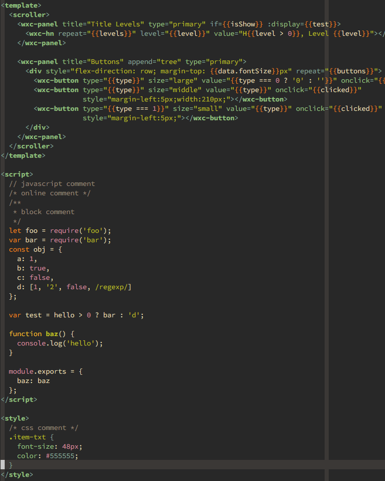
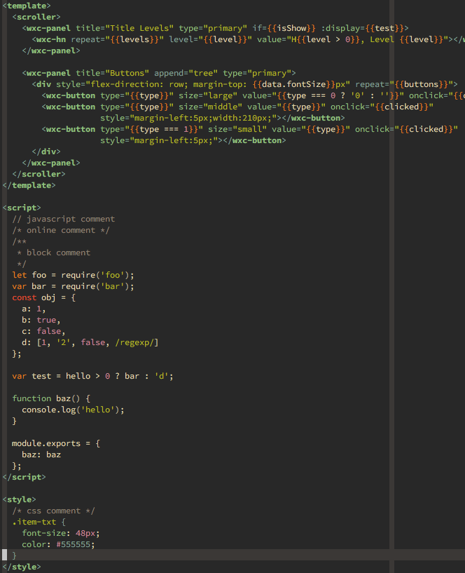

# weex.vim
[Weex][] syntax file for Vim.

## Demo

* with [pangloss/vim-javascript][js](RECOMMENDATION)
    
* without pangloss/vim-javascript
    

## Installation

For better JavaScript syntax highlighting, [pangloss/vim-javascript][js] or 
[othree/yajs.vim][yajs] is recommended, but not required.

Use [Vundle][vundle]:

```
Plugin 'yuezk/weex.vim'
```

Use [vim-plug][plug]:

```
Plug 'yuezk/weex.vim'
```

Use [NeoBundle][bundle]:

```
NeoBundle 'yuezk/weex.vim'
```

## Changelog

### 2017-02-10

- Modify syntax region name for better comment
- Imporove indent

### 2017-02-09

- Add indent file

### 2017-02-04

- Improve syntax highlighting
- Add demo captures

### 2016-05-28

- Basic syntax highlighting

[Weex]: http://alibaba.github.io/weex/
[vundle]: https://github.com/gmarik/vundle
[plug]: https://github.com/junegunn/vim-plug
[bundle]: https://github.com/Shougo/neobundle.vim
[js]: https://github.com/pangloss/vim-javascript
[yajs]: https://github.com/othree/yajs.vim
